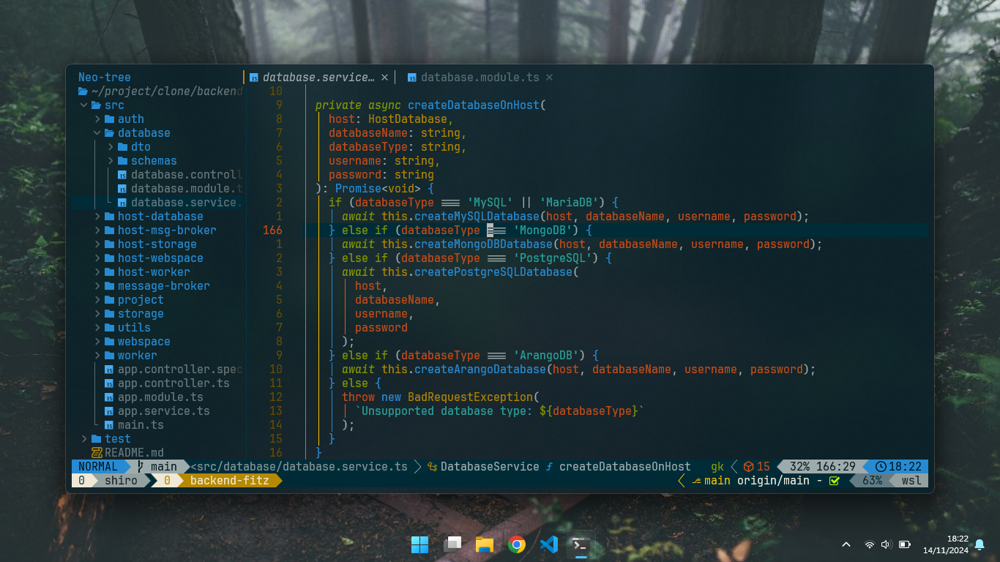
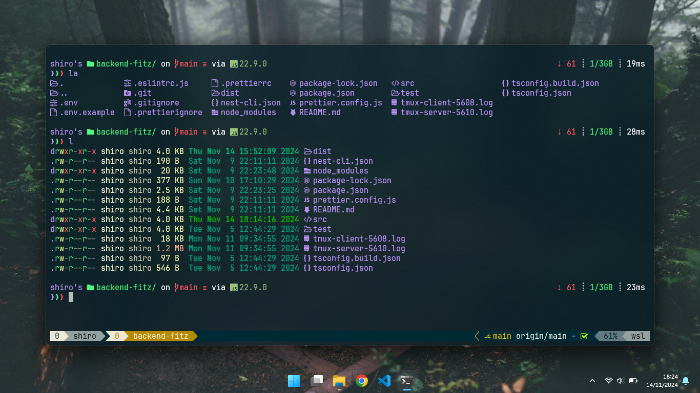

# Ghozi's dotfiles

Special thanks to [craftzdog](https://github.com/craftzdog) for sharing their dotfiles setup, which provided valuable inspiration and guidance for my dotfiles.

Check out his awesome [dotfiles repository](https://github.com/craftzdog/dotfiles-public) for more setup ideas and configuration tips.

## Contents

- vim (Neovim) config
- PowerShell config
- bash config
- tmux config
- terminal config

## Neovim setup

### Requirements

- Neovim >= **0.10.2** (needs to be built with **LuaJIT**)
- Git >= **2.19.0** (for partial clones support)
- [LazyVim](https://www.lazyvim.org/)
- a [Nerd Font](https://www.nerdfonts.com/)(v3.0 or greater) **_(optional, but needed to display some icons)_**
- [lazygit](https://github.com/jesseduffield/lazygit)
- a **C** compiler for `nvim-treesitter`. See [here](https://github.com/nvim-treesitter/nvim-treesitter#requirements)
- for [telescope.nvim](https://github.com/nvim-telescope/telescope.nvim) **_(optional)_**
  - **live grep**: [ripgrep](https://github.com/BurntSushi/ripgrep)
  - **find files**: [fd](https://github.com/sharkdp/fd)
- a terminal that support true color and *undercurl*:
  - [kitty](https://github.com/kovidgoyal/kitty) **_(Linux & Macos)_**
  - [wezterm](https://github.com/wez/wezterm) **_(Linux, Macos & Windows)_**
  - [alacritty](https://github.com/alacritty/alacritty) **_(Linux, Macos & Windows)_**
  - [iterm2](https://iterm2.com/) **_(Macos)_**
- [Solarized Osaka](https://github.com/craftzdog/solarized-osaka.nvim)

## PowerShell setup (Windows)

- [Scoop](https://scoop.sh/) - A command-line installer
- [Git for Windows](https://gitforwindows.org/)
- [Oh My Posh](https://ohmyposh.dev/) - Prompt theme engine
- [Terminal Icons](https://github.com/devblackops/Terminal-Icons) - Folder and file icons
- [PSReadLine](https://docs.microsoft.com/en-us/powershell/module/psreadline/) - Cmdlets for customizing the editing environment, used for autocompletion
- [z](https://www.powershellgallery.com/packages/z) - Directory jumper
- [PSFzf](https://github.com/kelleyma49/PSFzf) - Fuzzy finder

## Bash
- [Oh My Posh](https://ohmyposh.dev/) - Prompt theme engine
- [lsd](https://github.com/lsd-rs/lsd) - The next gen ls command
- [z](https://github.com/rupa/z) - jump around
- [fzf](https://github.com/junegunn/fzf) - A command-line fuzzy finder
  
## Tmux
- [Gitmux](https://github.com/arl/gitmux) - Gitmux shows git status in your tmux status bar

## Windows Terminal
- Theme base [Dracula](https://draculatheme.com/windows-terminal) - Dracula Theme for Windows Terminal
- [Nerd Font](https://www.nerdfonts.com/) - Iconic font aggregator, collection, and patcher

(<a href="#readme-top">back to top</a>)

